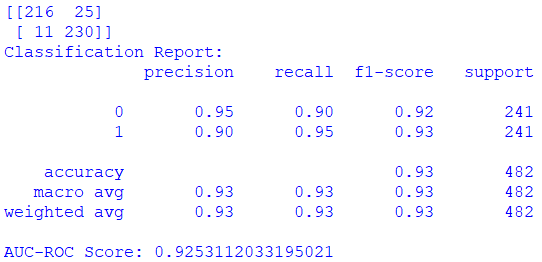

# Thyroid Nodule CNN Proof of Concept

This repository presents a reproducible proof-of-concept study investigating whether convolutional neural networks can distinguish benign and malignant thyroid-nodule ultrasound images.

The work covers image preparation, stratified train/validation/test splitting, multiple CNN architectures, probability averaging and evaluation with confusion matrices, classification metrics and ROC AUC. It is a research prototype and **must not be used for diagnosis or clinical decision-making**.

## Results retained from the study

| Experiment | Accuracy | ROC AUC | Test support |
|---|---:|---:|---:|
| Cropped-image ensemble | 0.88 | 0.882 | 502 |
| Uncropped-image ensemble | 0.93 | 0.925 | 482 |

These figures come from stored experiment reports in the original proof-of-concept archive. They describe those specific dataset splits and do not establish clinical validity or generalization to another hospital, device or patient population.



## Repository boundaries

Included:

- Reconstructed, environment-independent training and evaluation utilities
- Model builders for AlexNet, InceptionV3 and InceptionResNetV2
- Dataset-splitting code that copies rather than mutates source data
- Evaluation reports and the proof-of-concept journal

Excluded:

- Ultrasound images and patient-linked metadata
- Hospital data and private data-submission infrastructure
- Trained model files and serialized datasets
- Historical scripts containing local paths and repeated experimental code

## Data layout

Prepare a binary image dataset with one directory per class, then split it:

```text
dataset/
├── benign/
└── malignant/
```

The training commands expect:

```text
split-data/
├── train/{benign,malignant}/
├── validation/{benign,malignant}/
└── test/{benign,malignant}/
```

The original proof of concept used a public Kaggle dataset. Review `DATA.md` before reproducing the study and comply with the dataset's current licence and terms.

## Environment

```bash
python -m venv .venv
source .venv/bin/activate  # Windows: .venv\Scripts\activate
python -m pip install -e .
```

## Train and evaluate

```bash
python -m thyroid_poc.train split-data --architecture inception_v3 --epochs 30
python -m thyroid_poc.evaluate artifacts/model.keras split-data
```

For an ensemble:

```bash
python -m thyroid_poc.ensemble split-data artifacts/model-a.keras artifacts/model-b.keras
```

## Research documentation

- [Model card](MODEL_CARD.md)
- [Data statement](DATA.md)
- [Proof-of-concept journal](docs/proof-of-concept-journal.pdf)

## Limitations

- Retrospective proof-of-concept evaluation on a public dataset
- No prospective clinical study or external hospital validation is represented here
- Possible sensitivity to ultrasound device, acquisition protocol and dataset composition
- No subgroup analysis was available in the retained experiment
- Accuracy alone is inadequate for clinical deployment

## Data governance

Confirm institutional and collaborator permission before sharing any hospital data or derived private material.
