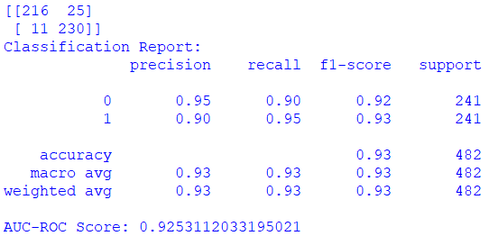

# Thyroid Nodule CNN Proof of Concept

A research project exploring CNN classification of thyroid ultrasound images, now accompanied by a tested pipeline for dataset provenance, training and reproducible evaluation.

I led the original proof-of-concept work: reviewing related research, building CNN models on public/Kaggle images and comparing individual models and ensembles. This repository separates that historical study from the maintained software. It contains **no hospital images, private submission system or clinical validation**.

## Explore the work

- [Historical study and its limitations](#historical-study): what the early results actually show.
- [Dataset pipeline](src/thyroid_poc/data.py): deterministic group-aware splitting, exact-duplicate checks and immutable manifests.
- [Evaluation](src/thyroid_poc/evaluate.py) and [metrics](src/thyroid_poc/metrics.py): per-image probabilities, model hashes, confusion matrices, probability ROC AUC and ensemble results.
- [Tests](tests): synthetic regression tests and real TensorFlow train/save/reload smoke tests.
- [Data statement](DATA.md) and [model card](MODEL_CARD.md): provenance, intended use and unresolved evidence.

## Maintained implementation

```text
Authorized class directories + group CSV
            │
      hash and validate
            ▼
 immutable train / validation / test manifest
            │
 train + validation only ──► .keras + metadata + history
            │
 held-out test ──► aligned probabilities ──► individual / mean-ensemble report
```

The pipeline keeps every explicit group and connected exact-byte duplicate in one partition. It rejects conflicting duplicate labels, incomplete group mappings, tiny class groups, existing destinations, changed files and untracked files. Splits use sorted inputs and a recorded seed. Ratios are approximate because patient/case groups are indivisible; every partition must contain both classes.

The three model builders are an AlexNet-style CNN, InceptionV3 and InceptionResNetV2. RGB conversion and bilinear resizing are shared; normalization lives inside the serialized model. Transfer models can explicitly download ImageNet weights and freeze the backbone, or train a randomly initialized backbone. This implementation is a reconstruction, **not the exact four-model code used for the archived figures**.

## Reproduce the software checks

Python 3.12 is the tested runtime. No data or pretrained weights are downloaded by the tests.

```bash
python -m venv .venv
# Activate: Windows .venv\Scripts\activate; macOS/Linux source .venv/bin/activate
python -m pip install -e .
python -m unittest discover -s tests -v
```

The default suite needs NumPy/Pillow only and skips the two TensorFlow tests. For actual CPU model execution:

```bash
python -m pip install -r requirements-runtime.txt
# PowerShell: $env:RUN_ML_TESTS="1"; $env:TF_ENABLE_ONEDNN_OPTS="0"
# macOS/Linux: export RUN_ML_TESTS=1 TF_ENABLE_ONEDNN_OPTS=0
python -m unittest discover -s tests -v
```

The runtime suite builds and forwards all three architectures with random weights, trains an AlexNet-style model for two epochs on generated colour images, saves/reloads it, verifies predictions, and produces individual/ensemble evaluation artifacts in temporary storage. **Synthetic checks establish software behaviour, not ultrasound accuracy.** See [validation record](docs/validation.md) for the tested environment and limitations.

## Use an authorized dataset

Read [DATA.md](DATA.md) first. The dataset root needs two class directories; their sorted names define class indices 0 and 1. A sigmoid output is always the probability of the second class, recorded in metadata and reports.

```text
dataset/benign/case001.png
dataset/malignant/case002.png
```

Provide `groups.csv`, covering exactly every supported image. Use an opaque patient/case ID that keeps repeated views, nodules and derived crops together according to the study protocol; do not put names or identifiers in public artifacts.

```csv
path,group
benign/case001.png,case-001
malignant/case002.png,case-002
```

This abbreviated example is a schema, not enough data for three partitions. Each class needs at least three independent components.

```bash
python -m thyroid_poc.data dataset split-data --groups groups.csv --seed 42
python -m thyroid_poc.train split-data --architecture alexnet --epochs 30 --output artifacts/alexnet.keras
# Optional ImageNet download, only when explicitly requested:
python -m thyroid_poc.train split-data --architecture inception_v3 --pretrained --output artifacts/inception.keras
python -m thyroid_poc.evaluate artifacts/alexnet.keras split-data --output artifacts/alexnet-test.json
python -m thyroid_poc.ensemble split-data artifacts/alexnet.keras artifacts/inception.keras --output artifacts/ensemble-test.json
```

`--independent-images` is an explicit alternative only for genuinely independent examples, such as the synthetic fixtures. It is **not a shortcut for unknown patient grouping**. Byte hashing cannot detect differently encoded, cropped or augmented copies; identify them through the group mapping. Apply augmentation only after splitting.

Every model requires its `.metadata.json` sidecar. Evaluation checks model bytes, class order, dataset fingerprint and overlap with training/validation hashes. It processes manifest rows in fixed order and saves each sample's ID, hash, group, label and model probabilities. ROC AUC uses probabilities; undefined metrics are `null`. Thresholds must be selected before test evaluation. Reports refuse overwrite. The evaluator intentionally accepts only the recorded dataset; a separate external-validation protocol is not implemented.

## Historical study

| Archived experiment | Reported accuracy | Evaluation images | Interpretation |
|---|---:|---:|---|
| Cropped-image ensemble | 0.88 | 502 | Evaluation reused fine-tuning images |
| Uncropped-image ensemble | 0.93 | 482 | Evaluation reused fine-tuning images |

The [original journal](docs/proof-of-concept-journal.pdf), pages 4 and 6, explicitly describes this overlap. These are **historical in-sample figures, not held-out test accuracy**. Some archived ROC AUC calculations used thresholded class predictions instead of continuous probabilities; the archived AUC values should not be read as a validated ranking-performance estimate. Different cohorts also prevent a controlled cropped-versus-uncropped comparison.



The historical images/PDF are retained as research records. Their original captions and terminology have not been rewritten. Later private experiments are not included here, and the maintained pipeline has not been used to establish a new ultrasound result. This project taught me that split integrity and traceable predictions matter as much as model architecture.

## Boundaries

This is educational research software, **not a diagnostic, screening or triage system**. No prospective clinical study, external hospital validation, calibration guarantee or subgroup fairness evaluation is represented. Exact dataset version, label provenance, grouping and rights remain prerequisites for a legitimate new experiment. Reproducible seeds do not guarantee bit-identical training across hardware or library versions.

The existing [all-rights-reserved licence](LICENSE) is unchanged. No raw data, trained clinical models or additional private research documents are published here.
