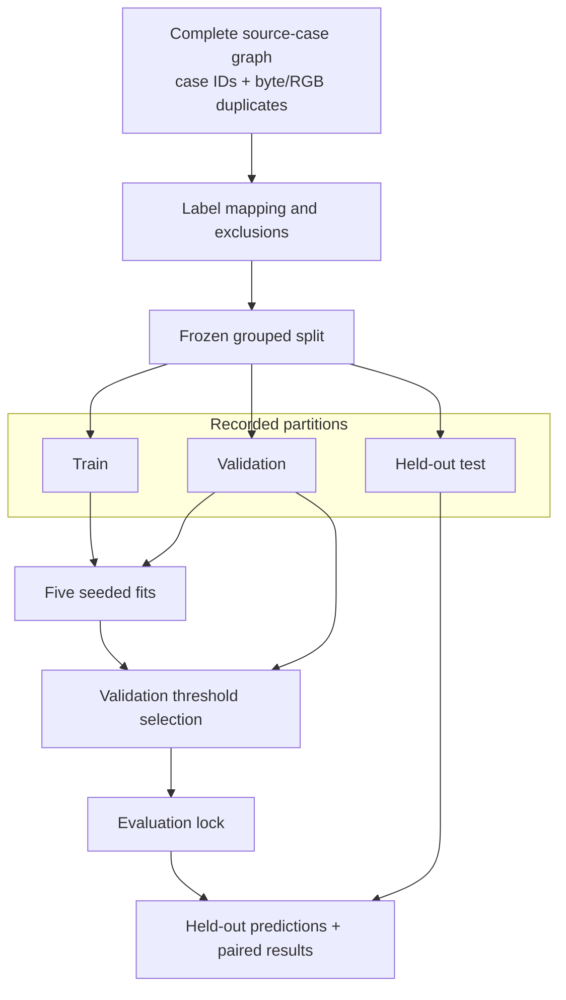
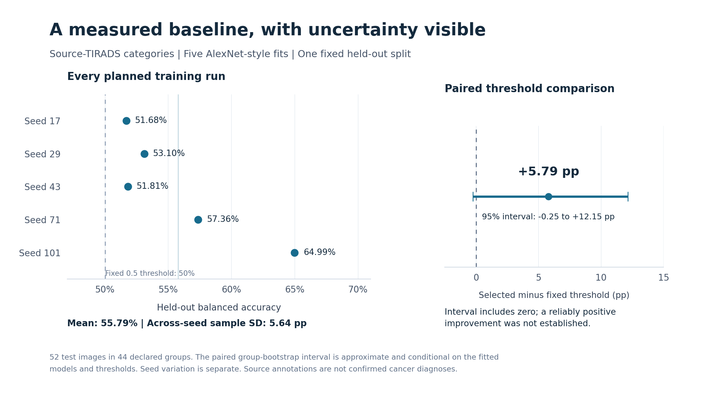

# Thyroid Nodule CNN Proof of Concept

**Modernized the original proof of concept into a reproducible, tested ML research pipeline.**

I led a thyroid-ultrasound CNN proof of concept at KMUTT's ESIC PLUS Laboratory: reviewing related research, building models on public/Kaggle images and investigating ensembles and cropped-versus-whole-scan inputs. Revisiting that work raised a useful engineering question: how can every result be traced back to its data, training choices and evaluation protocol?

The current implementation answers that question with validated data contracts, duplicate-aware grouped splits, traceable model artifacts, a resumable experiment runner and validation-only threshold selection before held-out evaluation.

**Python · TensorFlow / Keras · CNNs · experiment design · reproducible ML**

[Try the demo](#try-the-project) · [Explore the pipeline](#from-data-to-evaluation) · [Current results](#a-completed-five-seed-experiment) · [Model card](MODEL_CARD.md) · [Research journal](docs/proof-of-concept-journal.pdf)

## Try the project

From the repository root, run the dependency-free demonstration:

```bash
python demo.py
```

Open the reported `demo-output/run-*/report.html` file to explore the split, selected threshold, confusion matrix and recorded experiment. This mode uses generated colour images and **handcrafted probabilities**, so its synthetic scores demonstrate the workflow, not medical performance. The completed real-data aggregate appears in a separate section. No TensorFlow, medical data, network access or web server is needed.

For an optional small CNN demonstration after installing the runtime dependencies, use `python demo.py --cnn`. See the [demo guide](docs/demo.md) for setup and the distinction between the two modes.

## From data to evaluation


```mermaid
flowchart TD
    A["Complete source-case graph<br/>case IDs + byte/RGB duplicates"] --> B["Label mapping and exclusions"]
    B --> C["Frozen grouped split"]
    subgraph partitions["Recorded partitions"]
        T["Train"]
        V["Validation"]
        E["Held-out test"]
    end
    C --> T
    C --> V
    C --> E
    T --> F["Five seeded fits"]
    V --> F
    F --> S["Validation threshold selection"]
    V --> S
    S --> L["Evaluation lock"]
    L --> R["Held-out predictions + paired results"]
    E --> R
```

The diagram describes the completed measurement. All five fits and threshold selections finish before any test prediction. Integrity checks can inspect held-out bytes and manifest labels; fitting and selection use only the training and validation partitions. Declared groups are not verified independent patients.

| Engineering choice | Purpose |
|---|---|
| Connect case IDs and exact byte/decoded-RGB duplicates before label exclusions | Preserve duplicate links even through excluded cases, then keep connected groups in one partition |
| Bind manifests, models, sidecars and selection records with hashes | Detect changed inputs and mismatched artifacts instead of silently combining different experiments |
| Accept a checkpoint only after its worker exits successfully and its artifacts validate | Resume completed work while retaining failed attempts and rejecting damaged checkpoints |
| Seal fitting and threshold choices before test inference | Keep the final evaluation separate from model and threshold selection |
| Pair both thresholds on the same probabilities and test groups | Compare decisions without changing the fitted model or evaluation examples |

The library also provides AlexNet-style, InceptionV3 and InceptionResNetV2 builders and aligned probability-mean ensemble evaluation. Those are broader capabilities: **the measurement below uses five separate AlexNet-style fits, not an ensemble or an architecture comparison.** Explore the [source](src/thyroid_poc), [data protocol](DATA.md) and [experiment design](docs/measurement.md).

## A completed five-seed experiment

On **3 October 2026**, I completed a prespecified experiment on public DDTI ultrasound images. Its target was **source TIRADS 2/3 versus 4a/4b/4c/5**, not pathology-confirmed cancer. It compared a validation-selected threshold with 0.5 for each of five training seeds on the same held-out set: 52 images in 44 declared groups, including nine class-0 images.

| Measurement | Observed result |
|---|---:|
| Mean selected-threshold balanced accuracy | **55.79%** |
| Sample standard deviation across five fits | **5.64 percentage points** |
| Mean balanced accuracy at threshold 0.5 | **50.00%** |
| Mean paired difference | **+5.79 percentage points** |
| Approximate 95% conditional group-bootstrap interval for that difference | **−0.25 to +12.15 percentage points** |



*The left panel shows individual fitted runs; its sample SD describes variation across seeds. The right panel shows the conditional paired group-bootstrap interval, a different source of uncertainty. [Vector version](docs/visuals/measured-results.svg).*

Balanced accuracy gives both classes equal weight. At the fixed threshold, every model predicted the larger class: ordinary accuracy reached 82.69% while the other class was never identified. The selected thresholds changed that behaviour, yet the paired interval includes zero, so this experiment **does not establish a reliably positive improvement**. Five fits on one test set are not five independent test sets, and the bootstrap interval does not include retraining uncertainty.

All five results, the training recipe and the limitations are retained in the [model card](MODEL_CARD.md), [measurement protocol](docs/measurement.md) and [machine-readable aggregate](examples/recorded-measurement.json). Historical study scores use a different protocol and are not a before/after baseline.

## How the project developed

| Stage | Contribution and scope |
|---|---|
| **Original research** | Literature review and CNN proof of concept at KMUTT's ESIC PLUS Laboratory. The [journal](docs/proof-of-concept-journal.pdf) preserves the four-model study and acknowledges the professors and seniors who guided it. |
| **Later wider project** | Later hospital data, deployment in Thai hospitals and a private data-contribution mechanism are part of the wider project's author-reported history. They are separate from my documented proof of concept and are not independently verified by this rebuild. |
| **2026 engineering rebuild** | A reproducible research implementation with explicit label semantics, traceable artifacts, automated tests, an offline demonstration and a completed five-seed experiment. |

The [original result images](results/README.md) remain as historical records. Their evaluation reused fine-tuning images; the model card explains why they cannot be treated as held-out evidence. Codex assisted the 2026 implementation, debugging, tests and documentation under my direction.

## Run the checks

Use Python 3.12 for the recorded runtime. The core suite needs no medical dataset or TensorFlow:

```bash
python -m pip install -e ".[dev]"
python -m unittest discover -s tests -v
```

The recorded Windows checks collected 110 tests: **109 passed and one skipped** in the TensorFlow environment, or **104 passed and six skipped** without TensorFlow. Statement coverage was 93.30%, branch coverage 86.24%, and combined coverage 91.29%. These are software checks, including generated-image execution; they do not establish medical performance. See the dated [validation record](docs/validation.md) and current [GitHub Actions runs](https://github.com/IGoByLotsOfNames/thyroid-nodule-cnn-poc/actions/workflows/python.yml).

This is educational research software, not a diagnostic, screening or triage system. Medical images, sample-level research records and trained medical weights are not distributed. [Data provenance](DATA.md), [model scope](MODEL_CARD.md) and the existing [all-rights-reserved licence](LICENSE) explain the boundaries.
