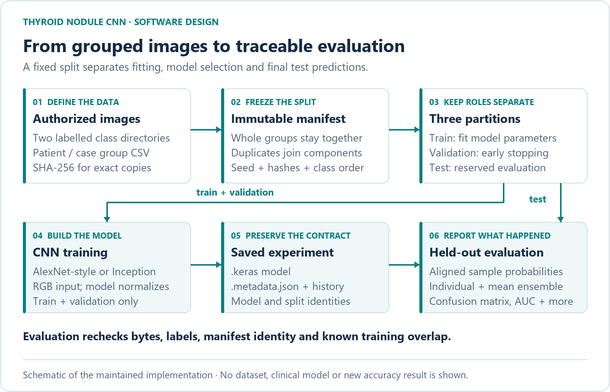
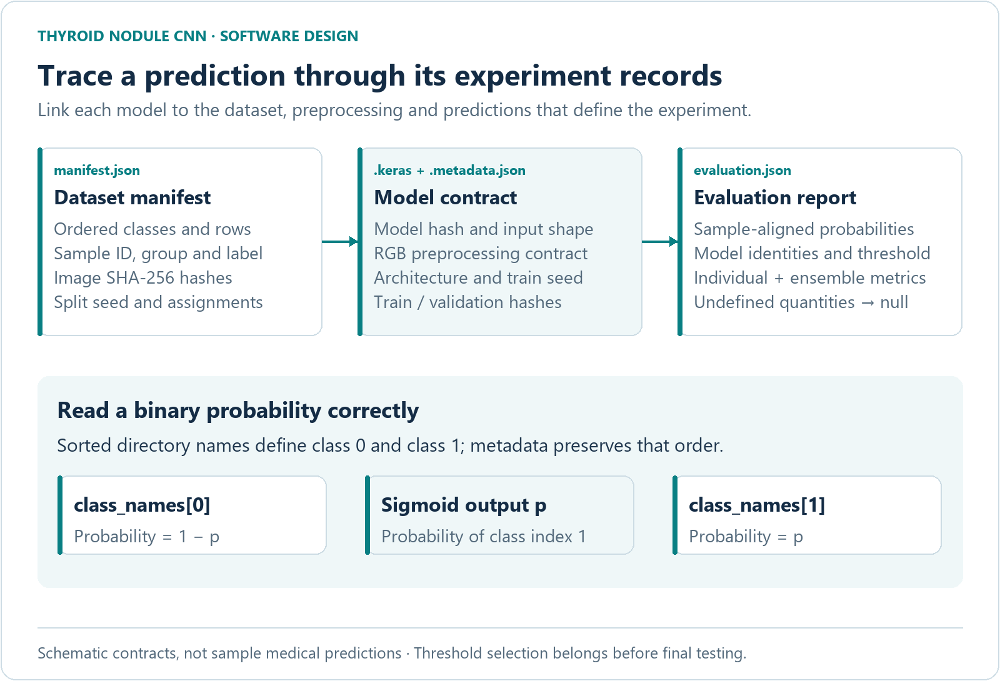

# Thyroid Nodule CNN Proof of Concept

**Exploring thyroid ultrasound classification through CNNs, ensemble experiments and traceable evaluation.**

I led the original proof of concept: reviewing related research, building CNN models on public/Kaggle images and comparing individual models with ensembles. The work developed my interest in applied AI—and in the experimental discipline needed to understand what a model's results actually mean.

This repository brings that research history together with a maintained Python implementation for dataset preparation, model training and evaluation. The emphasis is on making an experiment inspectable: which images were used, how classes were ordered, which model produced each probability, and whether evaluation data stayed separate from training.

**Python · TensorFlow / Keras · CNNs · transfer learning · ensemble evaluation · reproducible ML**

[Explore the pipeline](#from-data-to-evaluation) · [Read the research record](#original-research) · [Run the checks](#run-the-software-checks) · [Model card](MODEL_CARD.md) · [CI runs](https://github.com/IGoByLotsOfNames/thyroid-nodule-cnn-poc/actions/workflows/python.yml)

## From data to evaluation



*Software architecture schematic. The maintained pipeline has not established a new ultrasound accuracy result.*

The project has two complementary parts:

| Part | What it contains | What to look for |
|---|---|---|
| **Original research** | Literature review, CNN experiments and archived reports | My approach to a real research question, and a candid interpretation of the evidence |
| **Maintained implementation** | Validated dataset splits, three model builders, model metadata and evaluation reports | Data integrity, explicit contracts, reproducible execution and testable behaviour |

The maintained code reconstructs the research workflow; it is not the exact four-model implementation behind the historical figures. Its three builders are **AlexNet-style**, **InceptionV3** and **InceptionResNetV2**. The Inception models support an explicitly requested ImageNet download with a frozen backbone, or a randomly initialized backbone. No trained model or dataset is distributed.

## Engineering decisions worth exploring

| Decision | Why it matters | Implementation |
|---|---|---|
| Keep explicit groups and connected exact duplicates in one partition | Repeated views and copied files should not create artificial separation between train and test | [Dataset preparation](src/thyroid_poc/data.py) |
| Freeze a byte-verified manifest before fitting | An experiment should fail visibly when its inputs change | [Manifest validation](src/thyroid_poc/data.py) |
| Put normalization inside the serialized model | Training and inference share a defined RGB input contract | [Model builders](src/thyroid_poc/models.py) |
| Preserve class order, model hash and training history | A probability needs an unambiguous label and identifiable source | [Model artifacts](src/thyroid_poc/artifacts.py) |
| Align every model's predictions to the same test rows | Individual and mean-ensemble comparisons must refer to the same examples | [Evaluation](src/thyroid_poc/evaluate.py) and [metrics](src/thyroid_poc/metrics.py) |

Evaluation saves sample IDs, groups, labels, hashes and model probabilities, alongside a labelled confusion matrix, precision/recall/F1, probability ROC AUC, sensitivity/specificity, Brier score and log loss. Undefined metrics are recorded as `null`; reports refuse silent overwrite. The ensemble is an unweighted mean of aligned probabilities.



*The diagrams describe implemented contracts, not hypothetical patient predictions. [Regenerate the visuals](docs/visuals/render.py) with Pillow.*

## Run the software checks

Use **Python 3.12**, the tested runtime. Core tests need NumPy/Pillow and run without a dataset, pretrained weights or TensorFlow.

```bash
python -m venv .venv
# Windows: .venv\Scripts\activate
# macOS/Linux: source .venv/bin/activate
python -m pip install -e .
python -m unittest discover -s tests -v
```

For actual CPU model execution, install the recorded runtime dependencies and enable the optional integration tests:

```bash
python -m pip install -r requirements-runtime.txt
# PowerShell: $env:RUN_ML_TESTS="1"; $env:TF_ENABLE_ONEDNN_OPTS="0"
# macOS/Linux: export RUN_ML_TESTS=1 TF_ENABLE_ONEDNN_OPTS=0
python -m unittest discover -s tests -v
```

The [validation record](docs/validation.md) documents **18 core tests and two TensorFlow integration tests**. They cover group/duplicate integrity, changed inputs, class semantics, metric calculations and aligned ensembles. The runtime suite forwards all three architectures, trains an AlexNet-style model for two epochs on generated colour images, saves/reloads it and evaluates temporary artifacts.

These checks establish software behaviour. Synthetic image metrics are deliberately not used as evidence of ultrasound performance. Current remote test status is available in [GitHub Actions](https://github.com/IGoByLotsOfNames/thyroid-nodule-cnn-poc/actions/workflows/python.yml).

## Train and evaluate an authorized dataset

Start with the [data provenance and split protocol](DATA.md). Verify the exact source, licence, labels and patient/case grouping before using real data.

The dataset contains two class directories. Their sorted names define indices 0 and 1; model metadata records the order. A sigmoid output is always the probability of **class index 1**.

```text
dataset/
├── benign/
│   └── case001.png
└── malignant/
    └── case002.png
```

Provide a CSV covering every image:

```csv
path,group
benign/case001.png,case-001
malignant/case002.png,case-002
```

This is a schema example, not enough data for three partitions. At least three independent components per class are needed. Patient/case IDs should keep repeated views, nodules and derived crops together according to the study protocol. Use opaque IDs and keep sensitive manifests private.

```bash
# 1. Freeze the split, preserving groups and exact duplicates
python -m thyroid_poc.data dataset split-data --groups groups.csv --seed 42

# 2. Fit using train + validation only
python -m thyroid_poc.train split-data --architecture alexnet --epochs 30 --output artifacts/alexnet.keras

# Optional: explicitly allow an ImageNet weights download
python -m thyroid_poc.train split-data --architecture inception_v3 --pretrained --output artifacts/inception.keras

# 3. Evaluate individual and mean-ensemble predictions on the recorded test split
python -m thyroid_poc.evaluate artifacts/alexnet.keras split-data --output artifacts/alexnet-test.json
python -m thyroid_poc.ensemble split-data artifacts/alexnet.keras artifacts/inception.keras --output artifacts/ensemble-test.json
```

Keep every model with its `.metadata.json` sidecar. Choose models and thresholds using training/validation data before final test evaluation. The evaluator accepts only the recorded dataset; external validation requires a separate protocol.

<details>
<summary><strong>Split guarantees and their practical limits</strong></summary>

- Inputs are sorted, hashed and allocated using a recorded seed. Whole groups and connected exact duplicates stay together; every partition must contain both classes.
- Group sizes make split ratios approximate. Conflicting duplicate labels, incomplete group mappings, unusable class coverage and existing destinations are rejected.
- Training and evaluation recheck bytes and reject added, missing, changed or untracked images. Test hashes cannot overlap the model's recorded training/validation hashes.
- Exact-byte hashing does not identify differently encoded, cropped or augmented copies. Those relationships belong in the group mapping; augmentation belongs after splitting.
- `--independent-images` is only for known-independent examples, such as synthetic fixtures. It cannot establish patient independence when grouping is unknown.
- Seeds aid reproducibility; they do not promise identical training across hardware or library versions.

See [DATA.md](DATA.md) for the full protocol and remaining provenance questions.

</details>

## Original research

The [proof-of-concept journal](docs/proof-of-concept-journal.pdf) preserves the original study. It records two historical ensemble summaries:

| Archived experiment | Reported accuracy | Evaluation images | Interpretation |
|---|---:|---:|---|
| Cropped-image ensemble | 0.88 | 502 | Evaluation reused fine-tuning images |
| Uncropped-image ensemble | 0.93 | 482 | Evaluation reused fine-tuning images |

**These are in-sample historical figures, not held-out test accuracy.** Pages 4 and 6 of the journal describe the overlap. The cohorts differ, so the figures do not establish a controlled advantage for uncropped images. Some archived ROC AUC calculations also used thresholded predictions rather than continuous probabilities.

The [cropped](results/cropped-ensemble-classification-report.png) and [uncropped](results/uncropped-ensemble-classification-report.png) reports remain available as research records. Their original labels have been retained. This work reinforced an important lesson for me: architecture comparisons are only useful when the data split, labels and evaluation protocol support the conclusion.

## Scope and further reading

This is **educational research software**, not a diagnostic, screening or triage system. The repository contains no hospital images, private submission system or clinical validation. Later private development is outside this public proof of concept.

- [Model card](MODEL_CARD.md): intended use, evaluation contract and evidence limits.
- [Data statement](DATA.md): provenance, grouping, rights and split protocol.
- [Validation record](docs/validation.md): test environment, observed checks and what remains unmeasured.
- [Source](src/thyroid_poc) and [tests](tests): the maintained implementation.

The existing [all-rights-reserved licence](LICENSE) applies.
